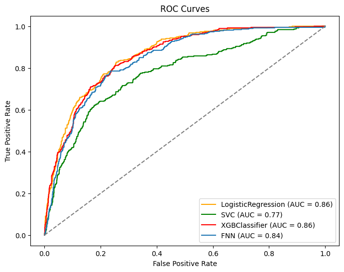

# Customer Churn Prediction ML,DL and WebApp

    

## **Churn Prediction Web App**

A Streamlit web app has been built to make customer churn prediction interactive, allowing users to input customer details and receive real-time predictions. The app is integrated with multiple machine learning models and is designed to help telecom companies retain customers by identifying those at risk of churn.

    

## **Introduction**
This project focuses on predicting customer churn for a telecom company using a combination of machine learning and deep learning techniques. The prediction of customer churn is crucial for businesses, as acquiring new clients is often more expensive than retaining existing ones. The goal is to understand how and why customers are leaving the business.
Customer churn, in this context, refers to when a customer decides to stop using a company's services. Analyzing customer churn is valuable for identifying customers at risk of leaving.

## **Data Description**
The [dataset](https://www.kaggle.com/datasets/blastchar/telco-customer-churn) provides comprehensive information on customer churn, services, account details, and demographic data, including:

- Churn: A binary column indicating whether customers left ('Yes') or stayed ('No') within the last month.
- Services: Information about services signed up for, such as phone, multiple lines, internet, and more.
- Customer Account Info: Details about customer tenure, contract type, payment method, and more.
- Demographics: Information including gender, age range, and partner and dependent status.

## **Objectives**
To guide our analysis, we have defined the following objectives:

1. Investigate the impact of customer tenure on churn.
2. Explore correlations between churn and factors like monthly charges and total charges.
3. Analyze the relationship between gender, partner status, and churn.
4. Examine the influence of technical support on customer churn.
5. Identify the most significant contract-related factors affecting churn.
6. Assess the quality of service for customers with streaming services.
7. Uncover insights related to phone and internet services in the telecom industry.

## **Conclusion**
In conclusion, this project is focused on predicting customer churn in the telecom industry. By following the outlined steps and utilizing the selected models, we aim to provide valuable insights and recommendations for reducing churn and improving customer retention.

## **Evaluating Model Effectiveness with ROC Curve and AUC**

      

## **Results** 

- Applied Logistic Regression, SVC, XGBClassifier, and Forward Neural Network for customer churn prediction.

- Conducted exploratory data analysis to unveil underlying patterns.

- Improved accuracy using SMOTETomek resampling, reducing false positives.

- Hyper tune the models and achieved commendable accuracy and ROC performance (~86%) across all models, except SVM.

- **Logistic Regression** and XGBClassifier demonstrated robust performance with an AUC of **0.86**.

- The **Forward Neural Network (FNN)** closely trailed with a competitive AUC of **0.84**.

- **Support Vector Classifier (SVC)** exhibited slightly lower effectiveness with an AUC of **0.77**.

## **Conclusion**

- In this customer churn prediction study, a comprehensive analysis of machine learning (ML) and deep learning (DL) models, including Logistic Regression, Support Vector Classifier (SVC), XGBClassifier, and a Forward Neural Network (FNN), was conducted. The goal was to discern the models' efficacy in handling imbalanced datasets, with a specific emphasis on accuracy and the area under the receiver operating characteristic curve (AUC).

- **Hyperparameter Tuning for Imbalanced Datasets**:

- To address the challenge posed by imbalanced data, hyperparameter tuning was applied across all models. The focus was on optimizing not only accuracy but also the F1 score, a crucial metric for imbalanced datasets. The tuning process aimed to strike a balance between effectively classifying both majority and minority classes.

- **Model Performance Metrics**:
After hyperparameter tuning, slight but significant differences in accuracy and AUC scores were observed among the selected models. It's noteworthy that accuracy alone is not a reliable metric for evaluating models dealing with imbalanced data. As anticipated, the ROC AUC scores emerged as more insightful indicators of the models' effectiveness in handling class imbalances.

- **ROC AUC Scores**:
The AUC scores revealed valuable insights into the models' performances. Logistic Regression and XGBClassifier demonstrated notable effectiveness with AUC scores of 0.86. The FNN closely followed with a commendable score of 0.84. However, the SVC model lagged slightly behind with an AUC score of 0.77, indicating potential challenges in handling imbalanced data compared to its counterparts.

- **Neural Network Optimization**:
The Forward Neural Network underwent a meticulous optimization process. Iteratively, the network architecture was refined from 2 to 6 hidden layers. The **learning rate** and the number of **epochs** were systematically adjusted, and the resultant changes in accuracy and loss were closely monitored. This step-by-step enhancement aimed to uncover the optimal configuration that maximizes predictive performance.

- Further exploration is recommended to advance predictive capabilities for customer churn prediction in imbalanced datasets.
