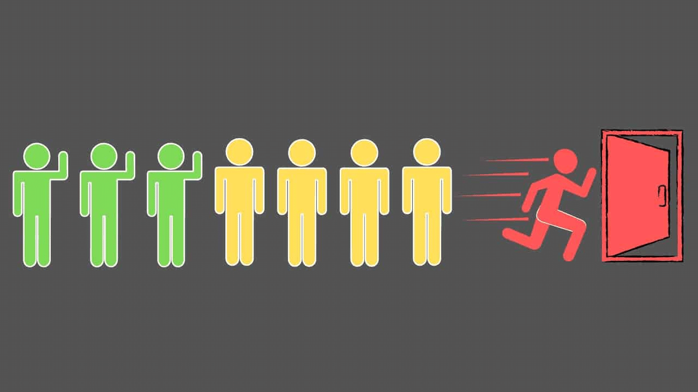

# Machine Learning, Deep Learning on Customer Churn Prediction 

    

## **Introduction**
This project focuses on predicting customer churn for a telecom company using a combination of machine learning and deep learning techniques. The prediction of customer churn is crucial for businesses, as acquiring new clients is often more expensive than retaining existing ones. The goal is to understand how and why customers are leaving the business.

## **Problem Description**
Customer churn, in this context, refers to when a customer decides to stop using a company's services. Analyzing customer churn is valuable for identifying customers at risk of leaving.

## **Data Description**
The [dataset](https://www.kaggle.com/datasets/blastchar/telco-customer-churn) provides comprehensive information on customer churn, services, account details, and demographic data, including:

- Churn: A binary column indicating whether customers left ('Yes') or stayed ('No') within the last month.
- Services: Information about services signed up for, such as phone, multiple lines, internet, and more.
- Customer Account Info: Details about customer tenure, contract type, payment method, and more.
- Demographics: Information including gender, age range, and partner and dependent status.

## **Objectives**
To guide our analysis, we have defined the following objectives:

1. Investigate the impact of customer tenure on churn.
2. Explore correlations between churn and factors like monthly charges and total charges.
3. Analyze the relationship between gender, partner status, and churn.
4. Examine the influence of technical support on customer churn.
5. Identify the most significant contract-related factors affecting churn.
6. Assess the quality of service for customers with streaming services.
7. Uncover insights related to phone and internet services in the telecom industry.

## **Steps**
1. **Problem Understanding**: Gain a clear understanding of the telecom churn prediction problem.
2. **EDA**: Explore the data through data cleaning, data visualization, and feature analysis.
3. **Data Split**: Divide the dataset into training and testing sets.
4. **Feature Engineering**: Transform categorical features into numerical representations and standardize the features.
5. **Model Training**: Train supervised learning models including Logistic Regression, Support Vector Machine, XGBoost, and Neural Network (Feedforward NN) on the training data.
6. **Summary**: Summarize the project's findings and outcomes.

## **Model Building**
We have chosen the following models for churn prediction, each serving specific purposes:

1. **Logistic Regression**:
   - Model: Simple linear model for binary classification.
   - Reason: It is interpretable, suitable for categorical features, and serves as a baseline model.

2. **Support Vector Machine (SVM)**:
   - Model: Effective for capturing complex decision boundaries.
   - Reason: SVM is effective at capturing non-linear relationships in the data. In churn prediction, where the relationship between features and churn might not be strictly linear, SVM's ability to create non-linear decision boundaries can be beneficial.

3. **XGBoost**:
   - Model: Ensemble model with high predictive performance.
   - Reason: XGBoost excels at handling categorical data with one-hot encoding and capturing complex relationships.

4. **Neural Network (Feedforward NN)**:
   - Model: Deep learning model for capturing non-linear patterns.
   - Reason: Suitable for high-dimensional data, excels in handling intricate relationships.

## **Conclusion**
In conclusion, this project is focused on predicting customer churn in the telecom industry. By following the outlined steps and utilizing the selected models, we aim to provide valuable insights and recommendations for reducing churn and improving customer retention.

## **Evaluating Model Effectiveness with ROC Curve and AUC**

      

## **Resulta** 

1. **Logistic Regression** and XGBClassifier demonstrated robust performance in effectively handling imbalanced data, both achieving an AUC score of '**0.86**.

2. The **Forward Neural Network (FNN)** closely trailed behind, showcasing competitive performance with an AUC score of **0.84**.

3. **Support Vector Classifier (SVC)** exhibited slightly lower effectiveness specifically in dealing with imbalanced data, obtaining an AUC score of **0.77**.
